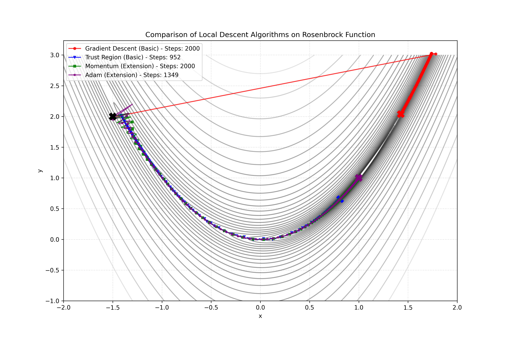
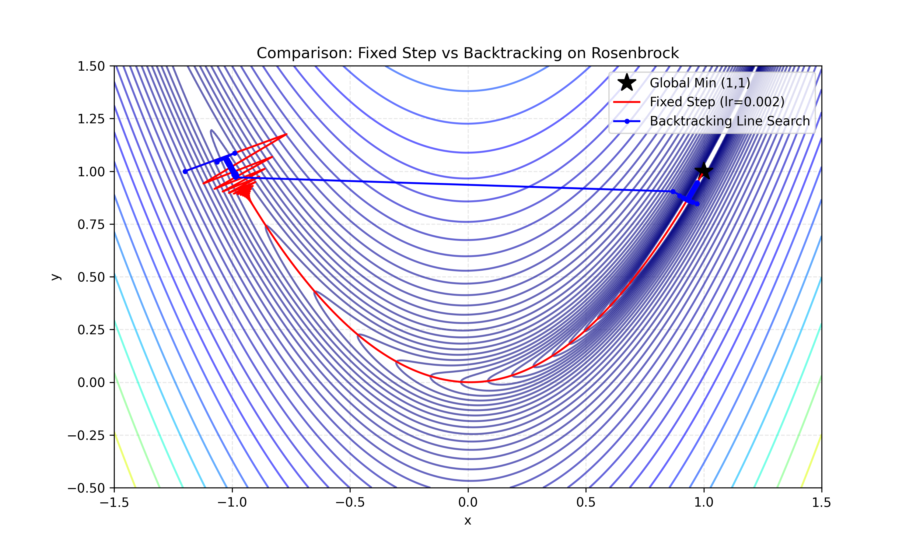

# Đồ án 3 — Local Descent (Tối ưu hóa cục bộ)

 

**Môn:** Cơ sở Trí tuệ Nhân tạo (CSAI) — Dựa trên Chương 4 “Algorithms for Optimization” (Kochenderfer & Wheeler)

---

## 📌 Tổng quan
Đồ án này hiện thực và so sánh các phương pháp tối ưu hóa cục bộ (Local Descent) trên các hàm thử nghiệm điển hình (ví dụ: Rosenbrock). Mục tiêu là so sánh hiệu quả hội tụ của các chiến lược chọn bước và kỹ thuật cải tiến như momentum/Adam, đồng thời minh họa hành vi trên contour của hàm mục tiêu.

## 🔍 Các thuật toán đã hiện thực
- Gradient Descent (Fixed Step Size)
- Backtracking Line Search (Armijo condition)
- Trust Region Methods (phiên bản đơn giản để minh họa)
- Momentum
- Adam Optimizer

---

## 📚 Mục lục
- [Tổng quan](#-tổng-quan)
- [Các thuật toán đã hiện thực](#-các-thuật-toán-đã-hiện-thực)
- [Yêu cầu & Cài đặt](#-yêu-cầu--cài-đặt)
- [Cách chạy / Ví dụ](#-cách-chạy--ví-dụ)
- [Cấu trúc thư mục](#-cấu-trúc-thư-mục)
- [Mô tả các file chính](#-mô-tả-các-file-chính)
- [Kết quả mẫu & Hình ảnh](#-kết-quả-mẫu--hình-ảnh)
- [Tài liệu tham khảo](#-tài-liệu-tham-khảo)

---

## 🛠️ Yêu cầu & Cài đặt
1. Clone repository:
   ```bash
   git clone https://github.com/trungkienjjj/HCMUS-CSAI-Project-3-LocalDescent.git
   cd HCMUS-CSAI-Project-3-LocalDescent
   ```
2. (Khuyến nghị) Tạo môi trường ảo và kích hoạt:
   ```bash
   python -m venv .venv
   source .venv/bin/activate   # Linux/macOS
   .venv\Scripts\activate    # Windows (PowerShell)
   ```
3. Cài dependencies:
   ```bash
   pip install -r requirements.txt
   ```
4. Phiên bản Python: 3.8+ (đã kiểm thử trên 3.8)

---

## ▶️ Cách chạy / Ví dụ
- Chạy thử script chính (so sánh các thuật toán trên Rosenbrock):
  ```bash
  python main.py
  ```
  Kết quả và hình ảnh sẽ được lưu mặc định vào `report/images/`.

- Thực nghiệm chi tiết cho Rosenbrock:
  ```bash
  python src/experiment_rosenbrock.py
  ```

- Kiểm tra hàm và gradient (bài tập kiểm chứng):
  ```bash
  python src/exercises_check.py
  ```

Ghi chú: nhiều script cho phép chỉnh tham số trực tiếp trong file hoặc mở rộng để nhận argument dòng lệnh — xem các file trong `src/` để biết chi tiết.

---

## 📂 Cấu trúc thư mục (tóm tắt)
```
CSAI_Project3_LocalDescent/
├── main.py                     # Script chính so sánh các thuật toán
├── requirements.txt            # Danh sách thư viện
├── README.md                   # Hướng dẫn (bản này)
├── src/                        # Mã nguồn chính
│   ├── algorithms.py           # GD, Line Search, Trust Region, Momentum, Adam
│   ├── functions.py            # Hàm thử nghiệm (Rosenbrock...) và gradient
│   ├── visualization.py        # Vẽ contour và đường hội tụ
│   ├── experiment_rosenbrock.py# Thực nghiệm Rosenbrock
│   └── exercises_check.py      # Kiểm chứng bài toán
└── report/                     # Báo cáo và hình ảnh kết quả
    ├── main.tex
    └── images/
        ├── result_chart.png
        └── result_experiment.png
```

---

## ℹ️ Mô tả các file chính
- src/algorithms.py: chứa cài đặt các thuật toán tối ưu hóa, trả về lịch sử điểm và giá trị hàm để phân tích.
- src/functions.py: định nghĩa hàm Rosenbrock (và có thể thêm các hàm khác) cùng gradient tương ứng.
- src/visualization.py: vẽ contour, đường đi của thuật toán và biểu đồ hội tụ.
- main.py: tập hợp các thử nghiệm, gọi các hàm tối ưu hóa và lưu kết quả vào `report/images/`.

---

## 📈 Kết quả mẫu & Hình ảnh
Dưới đây là một vài kết quả mẫu đã lưu trong `report/images/`:

- Biểu đồ so sánh hội tụ:
  

- Đường đi tối ưu trên contour (ví dụ Rosenbrock):
  


---

## 👥 Thành viên nhóm
| STT | Họ và Tên | MSSV | Vai trò |
|-----|-----------|------|---------:|
| 1   | Nguyễn Trần Trung Kiên | 23122038 | Trình bày phần Thực nghiệm, làm bài tập |
| 2   | Vũ Nguyễn Trung Hiếu     | 23122028 | Trình bày phần Mở rộng |
| 3   | Châu Văn Minh Khoa     | 23122035 | Tổng quan, Cơ sở lý thuyết |
| 4   | Phan Ngọc Quân     | 23122046 | Trình bày phần Phương pháp Local Descent |


---

## 📖 Tài liệu tham khảo
- Kochenderfer, M. J., & Wheeler, T. A. (2019). Algorithms for Optimization.
- Nocedal, J., & Wright, S. (2006). Numerical Optimization.
- Tài liệu môn CSAI — HCMUS.


